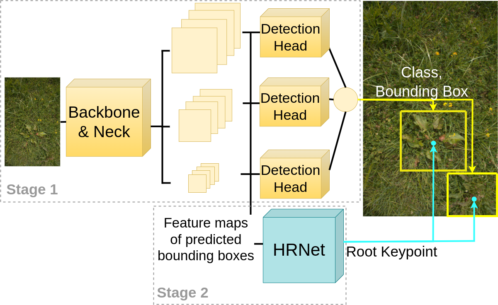

# YOLO-HRNet-on-RumexWeeds
This is the repository of YOLO-HRNet single-class implementation on RumexWeeds Dataset.


# Usage
## Environment
* Python >= 3.6
* Pytorch >= 1.8.0
* Detailed requirments are shown in `requirements.txt`

## Data preparation
For RumexWeeds data, please download from `to do`. We use \$your\_data\_path\$ to denote your saved data path. The original annotations are saved in xml format. We need to convert them into txt format. Please run
```
python3 convert_XML_to_COCO_in_YOLO.py --root=$your_data_path$ --target_dir='../RumexWeeds_root_YOLOtxt'
```
Please also change the train/val/test dataset info in `DataInfo.yaml`

## Training and Testing
### Training on RumexWeeds dataset
```
python3 train.py --batch-size=8 --optimizer='Adam' --weights='./yolov5m.pt' --hyp='./hyps/hyp.scratch-high.yaml' --img=640 --epochs=100 --cos-lr --roi_output_size=16
```

### Testing on RumenWeeds dataset
please put trained model under `./saved_model` folder
```
python3 Test.py --roi_output_size=16
```

# Results Visualization

